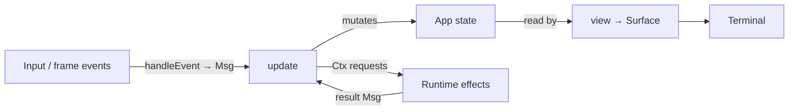

# Chasen (茶筅)

Chasen is a small-core Zig TUI runtime with Elm-inspired flow and explicit effects.

It provides a typed application loop, explicit runtime effects, and immediate
cell-based drawing through `Surface`. It does not try to be a batteries-included
widget framework.

## What Chasen Is

Chasen focuses on the runtime substrate needed to build terminal applications:

- Elm-inspired application flow with `Msg`, `update`, and `view`
- typed app messages instead of stringly event routing
- event-driven terminal runtime backed by libvaxis
- explicit runtime effect requests through `Ctx`
- timers, requested frame events, and background tasks with cooperative cancellation
- foreground commands with terminal handoff on Linux and macOS
- best-effort OSC 52 clipboard writes
- terminal image handles and placement, with an opt-in external path loader
- immediate drawing to `Surface`
- frame-scoped scratch allocation for render-time text and layout data
- small primitives such as `Rect`, text width helpers, child surfaces, and `Column`
- an optional, app-managed `ComponentStateStore` for component-local visual state

The goal is to keep the core predictable and small, while letting applications
and extension packages define their own look, layout, components, animation,
and domain behavior.

## What Chasen Is Not

Chasen intentionally does not include:

- a full widget set
- a general-purpose automatic layout engine
- a theme system
- a framework-owned retained component tree
- a router or screen manager
- an animation engine
- an image decoder
- an application framework with implicit state ownership

Those pieces can be built on top of Chasen when an application needs them.
`Column` provides simple vertical text placement, and `ComponentStateStore`
stores visual state without creating or managing a component tree. Frame events
provide timing for app-driven animation; interpolation and transitions remain
outside the core. Image decoding is supplied by an external loader.

Components can keep visual state directly in app-owned structs; they do not
need `ComponentStateStore`. When using a store, choose its lifetime explicitly:
removing entries runs their cleanup but retains arena memory until store
deinitialization. See [state ownership patterns](docs/AUTHORING_COMPONENTS.md#componentstatestore)
for direct fields and screen-scoped stores.

For example, [`chasen-ui`](https://github.com/hiroaqii/chasen-ui),
[`chasen-anim`](https://github.com/hiroaqii/chasen-anim), and
[`chasen-graphics`](https://github.com/hiroaqii/chasen-graphics) are optional
packages layered above the core.

## Requirements

- Zig **0.16.0**, the version used by CI. Compatibility with newer versions is not guaranteed.

## Installation

From your application's Zig project:

```sh
zig fetch --save git+https://github.com/hiroaqii/chasen.git
```

Add the dependency to `build.zig`. This complete example builds `src/main.zig`:

```zig
const std = @import("std");

pub fn build(b: *std.Build) void {
    const target = b.standardTargetOptions(.{});
    const optimize = b.standardOptimizeOption(.{});
    const chasen = b.dependency("chasen", .{
        .target = target,
        .optimize = optimize,
    });
    const exe = b.addExecutable(.{
        .name = "my-tui",
        .root_module = b.createModule(.{
            .root_source_file = b.path("src/main.zig"),
            .target = target,
            .optimize = optimize,
            .imports = &.{.{ .name = "chasen", .module = chasen.module("chasen") }},
        }),
    });
    b.installArtifact(exe);
}
```

## Minimal App

Messages drive state updates; `view` draws that state to a `Surface`.



This is a conceptual overview. See
[Runtime and Effects](docs/RUNTIME.md#application-lifecycle) for effect processing
order and redraw timing.

Save this as `src/main.zig`, then run `zig build` and `./zig-out/bin/my-tui`:

```zig
const std = @import("std");
const chasen = @import("chasen");

const App = struct {
    // The application owns its state. Chasen does not keep a separate widget
    // tree or hidden model for this counter.
    count: i32 = 0,

    // `Msg` is the typed set of state changes this app understands.
    // Input events, timers, tasks, and frame events are converted into these
    // messages before they reach `update`.
    pub const Msg = union(enum) {
        // This app's messages carry no heap ownership. Every Chasen app must
        // choose an undelivered-message policy explicitly.
        pub const undelivered_policy = .plain;

        inc,
        dec,
        quit,
    };

    // `handleEvent` is the optional boundary between terminal input and app
    // messages. Returning `null` means "this event did not affect app state".
    pub fn handleEvent(self: *const App, event: chasen.Event) ?Msg {
        _ = self;
        return switch (event) {
            .key_press => |key| switch (key.codepoint) {
                'j' => .dec,
                'k' => .inc,
                'q' => .quit,
                else => null,
            },
            else => null,
        };
    }

    // `update` is the only place this app mutates its state.
    // Runtime effects, such as quitting, are queued through `Ctx`.
    pub fn update(self: *App, msg: Msg, ctx: *chasen.Ctx(Msg)) !void {
        switch (msg) {
            .inc => self.count += 1,
            .dec => self.count -= 1,
            .quit => ctx.quit(),
        }
    }

    // `view` draws the current state to a Surface.
    // It does not return a string and does not mutate application state.
    pub fn view(self: *const App, surface: *chasen.Surface) !void {
        surface.clearAll();

        // `printAt` formats into Chasen's frame arena, so the temporary string
        // is valid until the current render finishes.
        _ = try surface.printAt(0, 0, .{}, "count: {d}", .{self.count});

        // `borrowTextAt` is cheap, but the text must outlive the render.
        // Static string literals are safe to borrow.
        _ = surface.borrowTextAt(0, 2, "j/k: change  q: quit", .{ .fg = .gray });
    }
};

// `chasen.run` owns terminal setup and cleanup. The app value passed here is
// the initial application state.
pub fn main(init: std.process.Init) !void {
    try chasen.run(init, App{});
}
```

`handleEvent` is optional. It maps terminal input to `Msg`; `update` changes app
state and requests effects; `view` draws the current state. Chasen owns terminal
setup, the event loop, redraws, and cleanup.

Every root `Msg` declares an undelivered-message policy. Use `.plain` for values
that can be discarded without cleanup. Use `.deinit` and `deinitUndelivered` for
heap-owning results; see [Runtime Message Ownership](docs/RUNTIME_MESSAGE_OWNERSHIP.md).

## Main APIs

| Purpose | API | Guide |
| --- | --- | --- |
| Quit or control redraw | `ctx.quit()`, `ctx.redraw().skip()` | [Runtime](docs/RUNTIME.md) |
| Timers and animation frames | `ctx.timer().tick/every/cancel`, `ctx.frame().request()` | [Timing](docs/RUNTIME.md#timers-and-frames) |
| Background work | `ctx.task().spawn/spawnOwned/requestCancel` | [Task ownership](docs/RUNTIME_MESSAGE_OWNERSHIP.md#task-context-and-cancellation) |
| Interactive external commands | `ctx.terminal().runForegroundCommand` | [Foreground commands](docs/RUNTIME.md#foreground-commands) |
| Clipboard writes | `ctx.terminal().copyToClipboard` | [OSC 52 semantics](docs/RUNTIME.md#clipboard) |
| Text, cells, and clipped regions | `Surface`, `Rect`, `Surface.child` | [Drawing](docs/SURFACE.md) |
| Terminal images | `ctx.image().loadPath/unload` | [Loader setup](docs/RUNTIME.md#terminal-images-and-options) |

Queued effects use [bounded pending queues](docs/RUNTIME.md#pending-request-limits).
Handle admission errors; a successful call accepts a request but does not
guarantee that its operation will start or complete. Timers accept a dedicated
non-owning Notice and mandatory callback: `tick(id, delay, notice, notify)` or
`every(id, interval, notice, notify)`. The callback receives firing or start
failure on the runtime thread and may create an owned Msg. Plain values are the
default; references require explicit `Borrowed(Ref)`. Simple notifications use
void without declaring a Notice type. Root `.deinit` remains compatible.
Completed one-shots are joined and reclaimed during runtime effect drains;
an internal wake makes this progress while the application is idle.
See [Timer Notice ownership](docs/RUNTIME_MESSAGE_OWNERSHIP.md#timer-notice-ownership)
and [timer timing and lifecycle](docs/RUNTIME.md#timers-and-frames).

For text created during `view`, use `printAt` or `copyTextAt`. Borrowed text must
remain valid until rendering finishes; do not borrow local stack buffers.
Image path loads require a configured `runWith` image loader; the default reports
`.unsupported`. Foreground execution is implemented for Linux and macOS.

## Examples

Clone the repository to run examples; they are not included in the fetched
library package:

```sh
git clone https://github.com/hiroaqii/chasen.git
cd chasen
zig build run-counter
```

Run any standard example with `zig build run-<name>`:

| Example | Demonstrates |
| --- | --- |
| `counter` | Minimal state/update/view loop |
| `selection` | Menu input mapped to messages |
| `stopwatch`, `tick` | Repeating and one-shot timers, replacement, cancellation |
| `http` | Background HTTP work |
| `owned_task_result` | Heap-owning results and shutdown cleanup |
| `task_cancellation` | Owned searches, replace/close, cooperative cancellation |
| `foreground_command` | External commands with terminal handoff |
| `animation` | Requested frame events |
| `surface_basics`, `surface_layout` | Drawing and clipped child surfaces |
| `runtime_stats`, `runtime_trace` | Runtime instrumentation callbacks |

Build all standard examples with `zig build check-examples`. The optional
`anim_transition` example needs a separate local `chasen-anim` checkout:

```sh
zig build run-anim_transition -Dchasen-anim-path=../chasen-anim
```

## Development and Testing

From a repository checkout:

```sh
TMPDIR="${TMPDIR:-/tmp}" zig build test
zig build check-io-threaded
zig build check-examples
zig build check-runtime-wasm
```

On Linux, unfiltered `zig build test` includes real PTY integration tests. The
foreground test needs an existing, writable `TMPDIR`. A Linux VM or container can
run these tests locally; cross-compiling on macOS checks compilation only.
See [Development and Testing](docs/DEVELOPMENT.md) for focused commands and CI coverage.

## Guides

- [Runtime and Effects](docs/RUNTIME.md): lifecycle, timing, terminal options, and the experimental Wasm boundary.
- [Surface Drawing](docs/SURFACE.md): cells, text lifetimes, and child surfaces.
- [Runtime Message Ownership](docs/RUNTIME_MESSAGE_OWNERSHIP.md): delivery, cancellation, and shutdown cleanup.
- [Authoring Components](docs/AUTHORING_COMPONENTS.md): reusable components, visual state, and drawing tests.

## Extension Packages

- [chasen-ui](https://github.com/hiroaqii/chasen-ui): layout helpers and reusable UI primitives.
- [chasen-anim](https://github.com/hiroaqii/chasen-anim): animation timing and transition math.
- [chasen-graphics](https://github.com/hiroaqii/chasen-graphics): image decoding and terminal image adapters.

These packages are optional. Applications can build directly on `Surface`.

## Current Status

Chasen is still experimental. The API is being shaped through real applications
such as [`gitframe`](https://github.com/hiroaqii/gitframe) and
[`lifegame-webterm`](https://github.com/hiroaqii/lifegame-webterm).

> [!CAUTION]
> Breaking changes are still possible while the core API is being finalized.

## Acknowledgements

- [Charm](https://charm.land/) influenced Chasen's Elm-inspired application flow.
- [libvaxis](https://github.com/rockorager/libvaxis) provides the terminal foundation.
