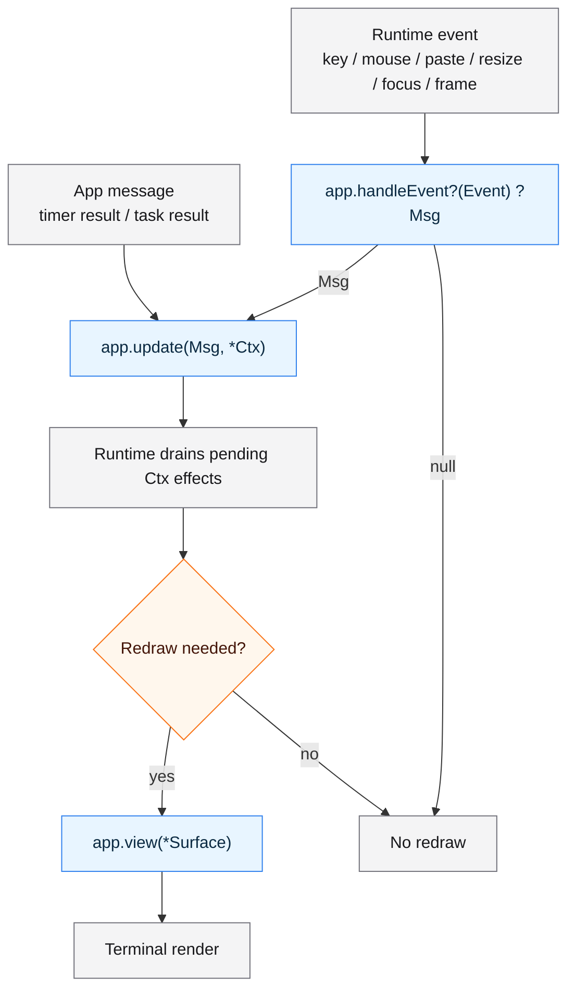

# Chasen (茶筅)

Chasen is a small-core TUI runtime for Zig.

It provides a typed application loop, explicit runtime effects, and immediate
cell-based drawing through `Surface`. It does not try to be a batteries-included
widget framework.

## What Chasen Is

Chasen focuses on the runtime substrate needed to build terminal applications:

- Elm-style application flow with `Msg`, `update`, and `view`
- typed app messages instead of stringly event routing
- event-driven terminal runtime backed by libvaxis
- explicit side effects through `Ctx`
- immediate drawing to `Surface`
- frame-scoped scratch allocation for render-time text and layout data
- small primitives such as `Rect`, text width helpers, and child surfaces

The goal is to keep the core predictable and small, while letting applications
and extension packages define their own look, layout, components, animation,
and domain behavior.

## Requirements

- Zig 0.16.0 or newer

Chasen uses Zig's `std.Io` runtime APIs, so older Zig versions are not a
supported target.

## Installation

Add Chasen to your Zig project with `zig fetch`:

```sh
zig fetch --save git+https://github.com/hiroaqii/chasen.git
```

Then import the dependency from your `build.zig` and expose it to your
executable or library module as `chasen`.

## What Chasen Is Not

Chasen intentionally does not include:

- a full widget set
- an automatic layout engine
- a theme system
- a retained component tree
- a router or screen manager
- an animation engine
- an image decoder
- an application framework with implicit state ownership

Those pieces can be built on top of Chasen when an application needs them.
For example, [`chasen-ui`](https://github.com/hiroaqii/chasen-ui),
[`chasen-anim`](https://github.com/hiroaqii/chasen-anim), and
[`chasen-graphics`](https://github.com/hiroaqii/chasen-graphics) are optional
packages layered above the core.

## Application Shape

A Chasen app is a Zig type with a `Msg` type and lifecycle functions.

```zig
const std = @import("std");
const chasen = @import("chasen");

const App = struct {
    // The application owns its state. Chasen does not keep a separate widget
    // tree or hidden model for this counter.
    count: i32 = 0,

    // `Msg` is the typed set of state changes this app understands.
    // Input events, timers, tasks, and frame events are converted into these
    // messages before they reach `update`.
    pub const Msg = union(enum) {
        // This app's messages carry no heap ownership. Every Chasen app must
        // choose an undelivered-message policy explicitly.
        pub const undelivered_policy = .plain;

        inc,
        dec,
        quit,
    };

    // `handleEvent` is the optional boundary between terminal input and app
    // messages. Returning `null` means "this event did not affect app state".
    pub fn handleEvent(self: *const App, event: chasen.Event) ?Msg {
        _ = self;
        return switch (event) {
            .key_press => |key| switch (key.codepoint) {
                'j' => .dec,
                'k' => .inc,
                'q' => .quit,
                else => null,
            },
            else => null,
        };
    }

    // `update` is the only place this app mutates its state.
    // Runtime effects, such as quitting, are queued through `Ctx`.
    pub fn update(self: *App, msg: Msg, ctx: *chasen.Ctx(Msg)) !void {
        switch (msg) {
            .inc => self.count += 1,
            .dec => self.count -= 1,
            .quit => ctx.quit(),
        }
    }

    // `view` draws the current state to a Surface.
    // It does not return a string and does not mutate application state.
    pub fn view(self: *const App, surface: *chasen.Surface) !void {
        surface.clearAll();

        // `printAt` formats into Chasen's frame arena, so the temporary string
        // is valid until the current render finishes.
        _ = try surface.printAt(0, 0, .{}, "count: {d}", .{self.count});

        // `borrowTextAt` is cheap, but the text must outlive the render.
        // Static string literals are safe to borrow.
        _ = surface.borrowTextAt(0, 2, "j/k: change  q: quit", .{ .fg = .gray });
    }
};

// `chasen.run` owns terminal setup and cleanup. The app value passed here is
// the initial application state.
pub fn main(init: std.process.Init) !void {
    try chasen.run(init, App{});
}
```

The runtime owns terminal setup, the event loop, effect draining, redraw policy,
and terminal cleanup. The app owns its state and decides how events become
messages.

### Undelivered Message Ownership

Every root `App.Msg` must declare an explicit shutdown ownership policy:

```zig
pub const undelivered_policy = .plain;
```

Use `.plain` only when every asynchronously produced message is safe to discard
by value. If a task result can own heap memory, choose `.deinit` and implement:

```zig
pub const undelivered_policy = .deinit;

pub fn deinitUndelivered(msg: *Msg, allocator: std.mem.Allocator) void {
    switch (msg.*) {
        .loaded => |payload| allocator.free(payload),
        else => {},
    }
    msg.* = undefined;
}
```

Chasen calls this hook on the runtime thread when a message can no longer enter
`App.update`, including task results completed during shutdown. A message passed
to `update` is already app-owned, even if `update` returns an error. Timer
templates passed to `tick` and `every` must remain non-owning/copy-safe; the
hook is for produced results, not for cleaning timer templates. See
[`docs/RUNTIME_MESSAGE_OWNERSHIP.md`](docs/RUNTIME_MESSAGE_OWNERSHIP.md) for the
complete delivery and shutdown contract. For a runnable implementation, see
[`examples/owned_task_result/main.zig`](examples/owned_task_result/main.zig),
which demonstrates normal `update` adoption, app-state cleanup, task failure,
and undelivered-result cleanup. Run it with
`zig build run-owned_task_result`.

## Runtime Flow

Chasen separates input handling, state updates, side effects, and rendering.

Startup is simple from the application side. `init` is optional, and effects
queued during `init` are drained before the first render.

Before the first render, Chasen also delivers the initial terminal size when it
is available, so apps that care about layout can initialize size-dependent state
through the normal event/update path.

In the diagram below, nodes starting with `app.` are implemented by the
application author. The other nodes are handled by the Chasen runtime.



Timer and task results skip `handleEvent` because they are already app messages.
Requested frame events go through `handleEvent`, so an animation app maps
`Event.frame` into its own `Msg` before `update` advances state.

If `handleEvent` returns `null`, Chasen does not call `update` and does not
redraw for that event. Resize is the exception: terminal resize always redraws
so the screen buffer matches the new terminal size.

### Why handleEvent Exists

`handleEvent` separates raw terminal input from application state transitions.

A terminal key press is not always an application action. The same key event
might become `.quit`, `.move_down`, `.open_picker`, or no message at all,
depending on the current screen and app state. By returning `?Msg`,
`handleEvent` lets the app explicitly decide which events matter.

This keeps `update` focused on domain messages instead of terminal/runtime event
details. Timer and task results already arrive as app messages, so they skip
`handleEvent` and go directly to `update`. Requested frame events still go
through `handleEvent`, which lets animation apps decide whether a frame matters
for their current state.

For apps that do not need keyboard, mouse, paste, resize, or focus handling,
`handleEvent` can be omitted entirely.

## Effects Through Ctx

Chasen does not make `update` return a command value. Instead, `update` receives
`*chasen.Ctx(Msg)` and queues runtime effects explicitly.

```zig
// Stop the runtime after the current update/effect cycle.
ctx.quit();

// Request one future frame event. Animations call this again while they continue.
ctx.frame().request();

// Skip the redraw after this update. Queued effects are still drained.
ctx.redraw().skip();

// Run background work that does not need captured app-owned context.
_ = try ctx.task().spawn(.{
    .run = Task.run,
    .failed = Task.failed,
});

// Transfer an owned typed context only after successful admission.
const task_id = ctx.task().spawnOwned(task, .{
    .run = Task.run,
    .failed = Task.failed,
    .cleanup = Task.destroy,
}) catch |err| {
    Task.destroy(task, ctx.allocator()); // admission failed: caller still owns it
    return err;
};
// Notify without waiting for the task to finish.
ctx.task().requestCancel(task_id);

// Send `.reload` once after the given delay.
try ctx.timer().tick("reload", 1_000_000_000, .reload);

// Send `.tick` repeatedly until the timer is cancelled or replaced.
try ctx.timer().every("clock", 1_000_000_000, .tick);

// Cancel a pending or running timer with this id.
try ctx.timer().cancel("clock");

// Queue a terminal image load. The request id lets the app ignore stale results.
const request_id = try ctx.image().loadPath(path, loaded, failed);

// Release an app-owned terminal image handle when it is no longer displayed.
try ctx.image().unload(handle);

// Send text to the terminal clipboard with a best-effort OSC 52 write.
const clipboard_request_id = try ctx.terminal().copyToClipboard(.{
    .text = text,
    .finished = App.clipboardCopyFinished,
});

// `ClipboardCopyResult.request_id` is the same opaque id. Keep any semantic
// page/surface metadata in app state under this id and take it on completion.
```

Most effects are stored in `Ctx` and drained after `init` or `update` returns.
Task cancellation is an immediate notification; it still leaves joining and
result cleanup to the runtime.

Task `run` returns `std.Io.Cancelable!Msg`; use `try` at standard Io cancellation
points. Plain `failed` accepts `chasen.TaskStartError` (`OutOfMemory` or
`ConcurrencyUnavailable`) and returns a Msg. For owned contexts the signatures
are `run(*T, Allocator, Io) Cancelable!Msg`,
`failed(*T, TaskStartError, Allocator) Msg`, and `cleanup(*T, Allocator) void`.
After successful admission Chasen calls cleanup exactly once. Run/failed must
not destroy the context themselves. Clear any field moved into an owning Msg.
Borrowed fields still need an application-proven lifetime through cleanup.

Task IDs need no release and are never reused within one Ctx/run. Admission can
fail with `TaskLimitExceeded` or `TaskIdExhausted`, leaving caller ownership.
`requestCancel` is an owning-runtime-thread operation (init/update), with no
allocation or join. Pending canceled/abandoned tasks only run cleanup; started
work can return `error.Canceled` without a Msg. A request does not revoke results
already produced/queued, so keep generation/identity checks for stale results.
Foreground commands continue to defer normal message delivery until TUI resume.

Shutdown notifies all started tasks before joining, discards pending contexts,
and finishes context/message cleanup before `App.deinit`. Non-cooperative code
can still block shutdown; cancellation does not undo side effects. Undelivered
Msgs are always destroyed on the runtime thread. Normal context cleanup runs on
the worker, start-failure/pending cleanup on runtime. Cleanup must be bounded,
not enqueue effects or join work.

The current standard-Io implementation uses a worker and a waiting supervisor
per started task, including plain tasks. `std.Io.Threaded` therefore needs two
concurrency units per live task, and its pool retains peak threads until backend
deinit. Reaping task records does not shrink that pool. See
[Runtime Message Ownership](docs/RUNTIME_MESSAGE_OWNERSHIP.md) for terminal and
testing contracts.

Try the [task cancellation example](examples/task_cancellation/main.zig) with
`zig build run-task_cancellation`. Space starts or replaces a three-second search,
x closes it, p increments a separate counter and refreshes cleanup observations,
and q quits, including while a search is waiting. Search results carry a generation
so a late result cannot reopen a closed or replaced search. Context creation and
cleanup counts are visible, and the process prints matching final counts after
shutdown. Cancel requests count explicit replace/close actions; shutdown also
requests cancellation internally.

Timer and frame effects are intentionally simple. `ctx.timer().every` is a
fixed-delay repeating timer: it waits for the interval, posts a message, then
waits for the interval again. Timer intervals do not compensate for app
update/render time. Timer message templates are copied/reused and must not own
heap allocations.
If the runtime cannot start or track a `tick` / `every` helper, there is no
timer failure callback and the timer message may never be delivered. Timers are
canceled during shutdown, but completed one-shot timer handles can remain
tracked until shutdown, so long-lived apps should avoid creating unbounded
unique timer ids.
`ctx.frame().request` requests one future frame event paced from the last
delivered frame, and is coalesced while a frame is already in flight. Animation
code should use `Frame.delta_ns` or `Frame.now_ns` for time-based movement
instead of assuming an exact frame rate. If an app has been idle without
frames, or if a foreground command interrupts a scheduled frame, the next
delivered frame can include a large elapsed delta.

Terminal clipboard writes use OSC 52 and are best-effort. A `.sent` result means
Chasen emitted the clipboard sequence to the tty; it does not prove that the
terminal or tmux accepted the payload. Detectable local write failures are
reported through the `finished` callback. `copyToClipboard` returns a
`ClipboardCopyRequestId`, and the callback receives the same id in
`ClipboardCopyResult`. Chasen owns the physical write only; apps should correlate
that id with request-time page or operation-surface metadata when completion
presentation depends on semantic origin.

`ctx.quit()` remains a direct shortcut because it is used by almost every
interactive app. `ctx.allocator()`, `ctx.io()`, and `ctx.now()` are direct
accessors because they are not runtime effects.

## Surface Drawing

Chasen views draw directly to a `Surface`.

### What Is a Surface?

A `Surface` is Chasen's drawing target. It represents a rectangular terminal
cell area where `view` writes text, styles, cursor changes, and terminal image
placements.

The root `Surface` covers the whole terminal screen. A child surface covers a
smaller clipped rectangle inside its parent.

```zig
pub fn view(self: *const App, surface: *chasen.Surface) !void {
    _ = self;
    surface.clearAll();

    // Coordinates are cell-based: (0, 0) is the top-left cell.
    // The first argument is the column, and the second is the row.
    _ = surface.borrowTextAt(0, 0, "Hello", .{ .bold = true });
}
```

### Why view Draws to Surface Instead of Returning a String

Chasen does not make `view` return a string. Instead, `view` draws directly to a
`Surface`.

String-returning views are simple and work well for text-only output, but they
make the final screen a flat byte stream. Once styles, clipping, cursor
placement, child regions, terminal images, or future non-terminal backends are
involved, Chasen needs to preserve cell-level structure.

`Surface` keeps drawing cell-based and explicit. The app draws into coordinates,
child surfaces define clipped regions, and the runtime can decide how to present
those cells through the terminal backend.

This also avoids building ANSI strings only to measure, clip, strip, or
reinterpret them later. Chasen keeps `view` as immediate drawing, while higher
level layout and widgets can be built above it when needed.

This gives applications direct access to:

- cell coordinates
- text styles
- child surfaces
- clipping
- cursor placement
- terminal image handles
- frame-scoped text allocation

`chasen.Cell` is a Chasen-owned text/style cell. It does not expose the
underlying terminal backend cell type. `Surface.readCell` is useful for tests
and same-frame read-modify-write effects, but the returned `char.grapheme` is
borrowed from the screen buffer. Copy it before storing it in model or
component state.

`CellChar.width = 0` means "unknown or backend-measured width". It is not a
trailing/continuation marker for wide text. If an app needs wide-text traversal,
it should derive that policy from its own text model, not from width-zero cells.

### Text Lifetimes

Chasen has both borrowed and frame-owned text drawing APIs.

Use `borrowTextAt` only when the text outlives the current render. Good inputs
are string literals, app state owned by the model, and other buffers that remain
valid until rendering finishes:

```zig
_ = surface.borrowTextAt(0, 0, "static label", .{});
```

> [!WARNING]
> Do not pass stack buffers or `std.fmt.bufPrint` results to `borrowTextAt`.
> `borrowTextAt` does not copy the bytes, so this can render corrupted text:
>
> ```text
> var buf: [64]u8 = undefined;
> const label = try std.fmt.bufPrint(&buf, "count: {d}", .{count});
> _ = surface.borrowTextAt(0, 0, label, .{}); // wrong: label points to stack memory
> ```

Use `printAt` for formatted text created during `view`. It formats into
Chasen's frame arena, so the text remains valid until the current render
finishes:

```zig
_ = try surface.printAt(0, 0, .{}, "count: {d}", .{count});
```

Use `copyTextAt` when the text slice is dynamic and should be copied into the
current frame before drawing:

```zig
_ = try surface.copyTextAt(0, 0, dynamic_label, .{});
```

As a rule of thumb: literals and model-owned strings can use `borrowTextAt`;
anything formatted or assembled inside `view` should use `printAt` or
`copyTextAt`.

Frame-owned text is allocated from a frame arena. The arena is reset before each
render and retains capacity so repeated redraws do not churn the allocator.

## Child Surfaces

`Surface.child(Rect)` creates a clipped local drawing area.

```zig
// A Rect describes a rectangular cell area on the parent surface.
// This one starts at column 2, row 3, and is 40 cells wide by 10 cells tall.
const body_rect = chasen.Rect{
    .col = 2,
    .row = 3,
    .width = 40,
    .height = 10,
};

// child() creates a clipped drawing surface for that rectangle.
var body = surface.child(body_rect);

// Coordinates inside the child are local: (0, 0) is the top-left cell of body.
_ = body.borrowTextAt(0, 0, "local coordinates", .{});
```

Child surfaces make it possible to build app-local panels, lists, editors,
overlays, and previews without requiring a framework-owned component tree.

> [!NOTE]
> For larger layouts, use
> [`chasen-ui.layout`](https://github.com/hiroaqii/chasen-ui) helpers to compute
> these `Rect` values. Chasen core keeps layout explicit, but real apps do not
> need to hand-write every rectangle calculation. `chasen-ui.layout` provides
> small allocation-free helpers while the app still owns layout policy and
> passes child surfaces to components.

## Extension Packages

Chasen keeps core primitives small. Higher-level pieces live outside the core.

- [`chasen-ui`](https://github.com/hiroaqii/chasen-ui): reusable UI primitives such as panels, status lines, overlays,
  list helpers, key hints, and basic display widgets
- [`chasen-anim`](https://github.com/hiroaqii/chasen-anim): animation timing helpers and transition math
- [`chasen-graphics`](https://github.com/hiroaqii/chasen-graphics): image decode and terminal image adapter helpers

Applications can use those packages, ignore them, or build their own layer
directly on top of `Surface`.

## Examples

Run examples from the `chasen` package directory.

```sh
cd chasen
zig build run-counter
```

Useful examples:

```sh
zig build run-counter        # minimal state/update/view loop
zig build run-selection      # selectable menu with Event -> Msg -> update
zig build run-stopwatch      # repeating timer with ctx.timer().every
zig build run-tick           # one-shot timer and timer cancellation
zig build run-owned_task_result # allocator-owned task result cleanup
zig build run-task_cancellation # owned search, replace/close, responsive cancel and quit
zig build run-animation      # frame request loop
zig build run-surface_layout # Rect-based regions and child surfaces
zig build run-runtime_stats  # runtime timing stats callback
zig build run-runtime_trace  # runtime trace callback
```

Build all standard examples without running them:

```sh
zig build check-examples
```

The `anim_transition` example depends on a local `chasen-anim` checkout:

```sh
zig build run-anim_transition -Dchasen-anim-path=../chasen-anim
```

## Browser / Wasm Direction

Chasen is terminal-first, but the app-facing runtime types are being shaped so
that update logic can be shared with browser/Wasm frontends where it makes
sense.

The current direction is not to make the terminal `Surface` magically render in
the browser. Instead, apps can share model/update logic and provide a separate
browser view or runner when needed.

This is experimental. The first validation app is
[`lifegame-webterm`](https://github.com/hiroaqii/lifegame-webterm), which shares
its core update path between terminal and browser/Wasm builds.

## Current Status

Chasen is still experimental. The API is being shaped through real applications
such as [`bgg-tui`](https://github.com/hiroaqii/bgg-tui),
[`gitframe`](https://github.com/hiroaqii/gitframe), and
[`lifegame-webterm`](https://github.com/hiroaqii/lifegame-webterm).

> [!CAUTION]
> Breaking changes are still possible while the core API is being finalized.

## Acknowledgements

Chasen is shaped by projects I respect:

- [Charm](https://charm.land/) introduced me to the appeal of Elm-style terminal applications.
- [libvaxis](https://github.com/rockorager/libvaxis) provides the terminal foundation that Chasen builds on.
