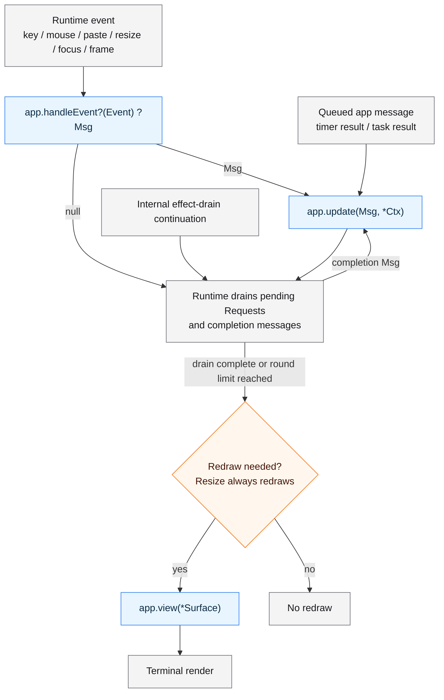

# Runtime and Effects

## Application Lifecycle

Chasen separates input handling, state updates, side effects, and rendering.

Startup is simple from the application side. `init` is optional, and effects
queued during `init` are drained before the first render.

Before the first render, Chasen also delivers the initial terminal size when it
is available, so apps that care about layout can initialize size-dependent state
through the normal event/update path.

The diagram below shows a normal event-loop turn. Nodes starting with `app.`
are implemented by the application author. The other nodes are handled by the
Chasen runtime.



Timer and task results skip `handleEvent` because they are already app messages.
Requested frame events go through `handleEvent`, so an animation app maps
`Event.frame` into its own `Msg` before `update` advances state.

If `handleEvent` returns `null` or is omitted, that event produces no app message.
The runtime still drains pending effects before deciding whether to redraw.
Effect completion messages, such as foreground-command or clipboard results,
go directly to `update` during the drain. Those updates can queue more effects
and request a redraw even when the original event produced no message.

The return edge from `update` resumes effect processing. Follow-up work is
processed in bounded rounds; remaining work continues in a later event-loop
turn. An internal continuation event enters the drain without calling
`handleEvent`.

Redraw is needed if any update in the turn requests it or a terminal resize
occurs. Resize forces a redraw even when `handleEvent` returns `null` or an
update calls `ctx.redraw().skip()`. It still passes through effect drain before
`view` and terminal rendering, so the screen buffer matches the new terminal
size.

Internally, `Events` owns bracketed-paste accumulation and the shared synchronous
`handleEvent`/`update` path. Each message resets redraw suppression before update;
an update error still leaves its message owned by the app. The small `Renderer`
inside Program owns the reusable frame arena and keeps view and terminal paint
timings separate. Program retains event/frame counters, effect-drain boundaries,
forced resize redraws, and the final stats callback for each turn.

## Input and Messages

The internal `TerminalSession` is initialized in its final storage and owns the
TTY buffer, Tty, Vaxis, input loop, terminal modes, resize polling, and suspension
flag. It coordinates reader stop/restart around feature changes and foreground
handoff. Program joins resize polling before the producer shutdown barrier;
reader cancellation needs neither another concurrency slot nor a DSR response.
`TerminalEffects` owns the image registry and processes foreground, clipboard,
and image requests at their existing separate effect stages. App dispatch stays
outside the session, and foreground restore does not emit a new resize event.

`handleEvent` separates raw terminal input from application state transitions.

A terminal key press is not always an application action. The same key event
might become `.quit`, `.move_down`, `.open_picker`, or no message at all,
depending on the current screen and app state. By returning `?Msg`,
`handleEvent` lets the app explicitly decide which events matter.

This keeps `update` focused on domain messages instead of terminal/runtime event
details. Timer and task results already arrive as app messages, so they skip
`handleEvent` and go directly to `update`. Requested frame events still go
through `handleEvent`, which lets animation apps decide whether a frame matters
for their current state.

For apps that do not need keyboard, mouse, paste, resize, or focus handling,
`handleEvent` can be omitted entirely.

## Effects Through Ctx

The fragments below illustrate independent requests inside `init` or `update`;
callbacks and application-specific values must be supplied by the app.

Chasen does not make `update` return a command value. Instead, `update` receives
`*chasen.Ctx(Msg)` and queues runtime effects explicitly.

Queued effects have [pending request limits](#pending-request-limits). The timer
examples use non-owning message variants; see the
[Timer restriction](RUNTIME_MESSAGE_OWNERSHIP.md#timer-restriction) before passing
other payloads.

```zig
// Stop the runtime after the current update/effect cycle.
ctx.quit();

// Request one future frame event. Animations call this again while they continue.
ctx.frame().request();

// Skip the redraw after this update. Queued effects are still drained.
ctx.redraw().skip();

// Run background work that does not need captured app-owned context.
_ = try ctx.task().spawn(.{
    .run = Task.run,
    .failed = Task.failed,
});

// Send `.reload` once after the given delay.
try ctx.timer().tick("reload", 1_000_000_000, .reload);

// Send `.tick` repeatedly until the timer is cancelled or replaced.
try ctx.timer().every("clock", 1_000_000_000, .tick);

// Cancel a pending or running timer with this id.
try ctx.timer().cancel("clock");

// Queue a terminal image load. The request id lets the app ignore stale results.
const request_id = try ctx.image().loadPath(path, loaded, failed);

// Release an app-owned terminal image handle when it is no longer displayed.
try ctx.image().unload(handle);

// Send text to the terminal clipboard with a best-effort OSC 52 write.
const clipboard_request_id = try ctx.terminal().copyToClipboard(.{
    .text = text,
    .finished = App.clipboardCopyFinished,
});

// `ClipboardCopyResult.request_id` is the same opaque id. Keep any semantic
// page/surface metadata in app state under this id and take it on completion.
```

`Ctx` borrows an initialized `Requests(Msg)` owner; it holds no pending queues.
Most effects are stored in that owner and drained after `init` or `update` returns.
The runtime supplies its allocator and Io explicitly and keeps it in stable
storage. Apps use the received `*Ctx` only during `init`/`update` on the runtime
thread. Headless tests use an explicitly initialized
[`TestCtx`](RUNTIME_MESSAGE_OWNERSHIP.md#tests-and-migration).
Task cancellation is an immediate notification; it still leaves joining and
result cleanup to the runtime.

`TaskRuntime(Msg)` owns live task nodes, starts workers, reaps completed
supervisors, and handles cancellation and joining. Program binds it to Requests
only in its final storage and unbinds it after joining. Shared terminal event
and completion-buffer types live in `program_types.zig`; backend-independent
frame timing lives in `runtime.zig`. The public root keeps the same event and
option exports.

`TimerRuntime(Msg)` owns each running timer's copied ID and Future. The effect
coordinator calls its cancel, tick, and every stages in that order; Program shuts
it down before joining tasks. Same-ID replacement cancels and joins the old Future before
starting the replacement. It shares the non-owning queue-post helper in
`program_types.zig` with frames; completed one-shot retention is unchanged.

`ctx.quit()` remains a direct shortcut because it is used by almost every
interactive app. `ctx.allocator()`, `ctx.io()`, and `ctx.now()` are direct
accessors because they are not runtime effects.

`ctx.redraw().skip()` suppresses redraw for the current message only. Its flag
is reset before each `update`; queued effects still drain. Resize redraws even
when the app suppresses redraw.

The internal `Effects(Msg)` owns the runtime-thread completion buffer and the
continuation-wake flag. It borrows the request and live owners during each drain;
Program keeps startup, event turns, rendering, and shutdown order explicit.
Each effect-drain pass processes runtime-thread completions, foreground commands,
clipboard writes, tasks, timer cancels, one-shot timers, repeating timers, images,
and frame requests in that order. Follow-up synchronous effects are processed
in at most eight rounds. Remaining work schedules one coalesced continuation
event. If the queue is full, its existing events already guarantee another turn;
the flag stays clear so a later drain can enqueue a wake.
The eight-round limit bounds repeated passes, not elapsed time: a long-running
callback or foreground command can still delay the event loop.

Each stage detaches its own fixed-capacity value batch immediately before use.
Follow-up requests occupy separate pending storage, so an update cannot overwrite
the batch being processed. On error, the stage releases its unconsumed suffix;
the request owner separately releases new pending work. Detaching adds no heap
allocation and does not change the existing stage order or queue limits.

For task callback signatures, admission-error handling, cancellation, cleanup,
and worker concurrency costs, see [Runtime Message Ownership](RUNTIME_MESSAGE_OWNERSHIP.md).
The [task cancellation example](../examples/task_cancellation/main.zig) shows
owned work, replace/close actions, and generation checks for late results.

## Pending Request Limits

Most effects first enter a fixed-capacity pending queue in `Requests`. Its slots
count requests that the runtime has not yet taken for processing. Each stage of
effect drain detaches its batch and empties that pending queue, making the slots
available for new requests even while the detached work is running.

The current capacities and queue-full errors are:

| Request through `Ctx` | Pending capacity | Queue-full error |
| --- | --- | --- |
| `task().spawn` / `spawnOwned` | 16 shared | `TaskLimitExceeded` |
| `timer().tick` | 8 | `TimerLimitExceeded` |
| `timer().every` | 8 | `TimerLimitExceeded` |
| `timer().cancel` | 8 | `TimerCancelLimitExceeded` |
| `image().loadPath` | 8 | `TerminalImageLoadLimitExceeded` |
| `image().unload` | 8 | `TerminalImageUnloadLimitExceeded` |
| `terminal().runForegroundCommand` | 1 | `ForegroundCommandLimitExceeded` |
| `terminal().copyToClipboard` | 4 | `ClipboardCopyLimitExceeded` |

These are current implementation capacities, not configurable settings or
guarantees that the numbers will remain unchanged. Handle admission errors.
For example, submitting a seventeenth task before the task stage drains the
queue fails; already-running tasks do not occupy those pending slots. Replacing
an entry already pending in the same `tick` or `every` queue reuses its slot.
An accepted `cancel` removes matching pending timers and queues cancellation of
running timers; if admission fails, it leaves those timers unchanged.

These limits do not cap the total number of running tasks or timers, the number
of bytes in their payloads, or the runtime's total memory use. Backend concurrency
limits are separate, and starting accepted work can still fail. `frame().request`
coalesces requests; `task().requestCancel` notifies directly instead of using a
queue in this table.

Ownership on admission depends on the API:

- `spawnOwned` transfers its context only on success. On an admission error,
  the caller still owns it and no task callback runs. After success, Chasen owns
  cleanup, including when the task never starts. See the
  [owned-task example](RUNTIME_MESSAGE_OWNERSHIP.md#queueing-an-owned-task).
- Timer calls copy IDs but only copy the message value; they do not take ownership
  of its referenced storage. Use a non-owning, copy-safe template as described in
  [Timer restriction](RUNTIME_MESSAGE_OWNERSHIP.md#timer-restriction).
- Image path loads, clipboard writes, and foreground commands own copies of their
  queued inputs after admission. The caller retains the original inputs. A
  foreground `.dir` cwd duplicates the descriptor; the caller retains the
  original. Failed admission releases any partially acquired internal copies.
- A rejected `image().unload` has not scheduled release of that handle. The app
  must still arrange its release, for example by queueing it in a later update.

Queue-full errors are only part of each API's error set. Copying inputs can fail
with `OutOfMemory`; task admission can return `TaskIdExhausted`; foreground
requests also validate their inputs. A successful call means admission, not
successful execution or delivery. In particular, timers currently have no
callback for failures after admission; see [Timers and Frames](#timers-and-frames).

## Timers and Frames

`tick(id, delay_ns, msg)` schedules one message; `every(id, interval_ns, msg)`
repeats until canceled or replaced. Scheduling either with the same id replaces
the running timer. IDs are copied while queueing, so temporary ID strings are
allowed. `cancel(id)` removes matching pending timers and queues cancellation
for a running timer; it can fail if the cancellation queue is full.
See the [tick example](../examples/tick/main.zig) for replacement and cancellation.

Timer and frame effects are intentionally simple. `ctx.timer().every` is a
fixed-delay repeating timer: it waits for the interval, posts a message, then
waits for the interval again. Timer intervals do not compensate for app
update/render time. Pass only non-owning, copy-safe message variants, including
when the root `Msg` uses `.deinit` for other variants. See
[Timer restriction](RUNTIME_MESSAGE_OWNERSHIP.md#timer-restriction) for safe payloads
and the distinction between templates and posted messages.

A successful `tick` / `every` call means the request was accepted, not that its
helper started or its message will arrive. If the runtime cannot start or track
the helper, there is no timer failure callback and the message may never be
delivered. Use a task with a failure callback when later progress depends on
observing a start failure.

Completed one-shot timers retain their copied ID and Future until replacement,
explicit cancellation, or shutdown. Long-lived apps should reuse a bounded set
of IDs or explicitly cancel completed timers, handling cancellation admission
errors. The pending queue limit does not bound these retained handles.

`ctx.frame().request` requests one future frame event paced from the last
delivered frame, and is coalesced while a frame is already in flight. Animation
code should use `Frame.delta_ns` or `Frame.now_ns` for time-based movement
instead of assuming an exact frame rate. If an app has been idle without
frames, or if a foreground command interrupts a scheduled frame, the next
delivered frame can include a large elapsed delta.

Internally, `FrameRuntime` owns the single frame future and the delivered
timestamp/index. Receiving a frame joins its producer before advancing that
timeline. A frame canceled during foreground suspension is joined and requested
again without advancing either value. Requests coalesce while a frame is in
flight; start failure consumes the request, and shutdown cancels the producer.

## Clipboard

Terminal clipboard writes use OSC 52 and are best-effort. A `.sent` result means
Chasen emitted the clipboard sequence to the tty; it does not prove that the
terminal or tmux accepted the payload. Detectable local write failures are
reported through the `finished` callback. `copyToClipboard` returns a
`ClipboardCopyRequestId`, and the callback receives the same id in
`ClipboardCopyResult`. Chasen owns the physical write only; apps should correlate
that id with request-time page or operation-surface metadata when completion
presentation depends on semantic origin.

## Foreground Commands

Use `ctx.terminal().runForegroundCommand` to run an interactive external command
with terminal ownership temporarily handed off from the TUI. This fragment
belongs in `update`; the callback maps completion into an application message:

```zig
_ = try ctx.terminal().runForegroundCommand(.{
    .argv = &.{ "vi", "notes.txt" },
    .finished = App.commandFinished,
});
```

```zig
fn commandFinished(result: chasen.ForegroundCommandResult) Msg {
    return .{ .command_finished = result };
}
```

Declare `command_finished: chasen.ForegroundCommandResult` in `Msg` and handle
its outcome in `update`. Completion includes the request id and an exit code,
signal, stopped-job result, runtime failure, or abandonment. Normal app-message
delivery is deferred until TUI resume. A stopped job is terminated and reaped;
this API does not keep resumable shell jobs. Cleanup or terminal-restoration
failures are fatal to the runtime; their callback messages are disposed as
undelivered rather than passed to `update`.

Commands execute the supplied argv directly, without shell parsing. Foreground
execution is implemented for Linux and macOS; Windows reports an unsupported
completion. See the [foreground command example](../examples/foreground_command/main.zig).

Arguments are copied while queueing. The default cwd and environment are inherited
at spawn time. A `.cwd = .{ .path = path }` copies the path but resolves it at
spawn time; `.cwd = .{ .dir = dir }` duplicates an open directory descriptor and
preserves directory identity across renames. The caller retains its original
handle. `.environment = .{ .replace = &map }` copies the map, including an empty
replacement. A bare executable name uses the parent's PATH even with a replacement
environment; use an absolute executable path when that distinction matters.

## Terminal Images and Options

`ctx.image().loadPath` needs a loader configured through
`chasen.runWith`'s `terminal.image_path_loader` field. The default is null, so
`chasen.run` reports `.unsupported` for path loads. Chasen provides image handles
and placement; an external adapter supplies decoding and transmission.

In an app with a loader matching `chasen.TerminalImagePathLoaderFn`:

```zig
try chasen.runWith(.{
    .runtime = .{ .allocator = init.gpa, .io = init.io },
    .terminal = .{
        .env_map = init.environ_map,
        .image_path_loader = image_loader,
    },
}, App{});
```

The optional `image_loader_context` is caller-owned. Image load callbacks receive
a request id for stale-result checks. Delivered image handles are app-managed:
queue `ctx.image().unload(handle)` when no longer needed, including stale loads.
During shutdown the runtime releases remaining registry handles; see
[message ownership](RUNTIME_MESSAGE_OWNERSHIP.md#runtime-thread-callbacks).

Other `runWith` options include opt-in mouse reporting (`terminal.mouse`),
cell-based mouse coordinates by default, and opt-in Kitty keyboard support
(`terminal.keyboard_protocol = .kitty`). The default keyboard protocol is
`.legacy`. Runtime options expose optional stats and trace callbacks; see the
[runtime_stats](../examples/runtime_stats/main.zig) and
[runtime_trace](../examples/runtime_trace/main.zig) examples.

## Browser / Wasm Boundary

The package exports `chasen_runtime` separately from the terminal `chasen` module.
It exposes backend-independent Ctx, ownership, stats, trace, and effect-policy
types. `zig build check-runtime-wasm` compiles a small usage check for
`wasm32-freestanding`; it does not validate a browser renderer or every API.

Apps can share model/update logic, but need their own browser view and runner.
`BrowserInitialEffects` describes an experimental subset: message dispatch,
timers, frames, redraw suppression, and quit. Tasks and terminal-specific effects
are outside that subset. Chasen does not ship a browser implementation of
terminal `Surface`.
